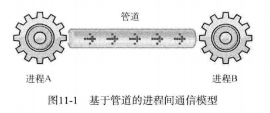
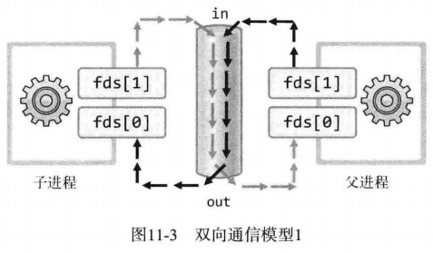
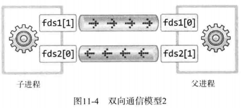

进程间通信，意味着两个不同的进程中可以交换数据



可以看出，为了完成进程间通信，需要创建进程。管道并非属于进程的资源，而是和套接字一样，属于操作系统（也就不是 fork 函数的复制对象只能复制管道对应的文件描述符）。所以，两个进程通过操作系统提供的内存空间进行通信。下面是创建管道的函数。

```
#include <unistd.h>
int pipe(int filedes[2]);
/*
成功时返回 0 ，失败时返回 -1
filedes[0]: 通过管道接收数据时使用的文件描述符，即管道出口
filedes[1]: 通过管道传输数据时使用的文件描述符，即管道入口
*/
```

父进程创建函数时将创建管道，同时获取对应于出入口的文件描述符，此时父进程可以读写同一管道。但父进程的目的是与子进程进行数据交换，因此需要将入口或出口中的 1 个文件描述符传递给子进程。下面的例子是关于该函数的使用方法：

- [pipe1.c](https://github.com/riba2534/TCP-IP-NetworkNote/blob/master/ch11/pipe1.c)

```
#include <stdio.h>
#include <unistd.h>
#define BUF_SIZE 30

int main(int argc, char *argv[])
{
    int fds[2];
    char str[] = "Who are you?";
    char buf[BUF_SIZE];
    pid_t pid;
    // 调用  pipe 函数创建管道，fds 数组中保存用于 I/O 的文件描述符
    pipe(fds);
    pid = fork(); //子进程将同时拥有创建管道获取的2个文件描述符，复制的并非管道，而是文件描述符
    if (pid == 0)
    {
        write(fds[1], str, sizeof(str));
    }
    else
    {
        read(fds[0], buf, BUF_SIZE);
        puts(buf);
    }
    return 0;
}
```


#### 通过管道进行进程间双向通信



下面是双向通信的示例：

- [pipe2.c](https://github.com/riba2534/TCP-IP-NetworkNote/blob/master/ch11/pipe2.c)

```
#include <stdio.h>
#include <unistd.h>
#define BUF_SIZE 30

int main(int argc, char *argv[])
{
    int fds[2];
    char str1[] = "Who are you?";
    char str2[] = "Thank you for your message";
    char buf[BUF_SIZE];
    pid_t pid;

    pipe(fds);
    pid = fork();
    if (pid == 0)
    {
        write(fds[1], str1, sizeof(str1));
        sleep(2);//防止子进程立马read
        read(fds[0], buf, BUF_SIZE);
        printf("Child proc output: %s \n", buf);
    }
    else
    {
        read(fds[0], buf, BUF_SIZE);
        printf("Parent proc output: %s \n", buf);
        write(fds[1], str2, sizeof(str2));
        sleep(3);
    }
    return 0;
}
```

上述的由一个管道所实现的双向管道有一个很致命的问题。

> 向管道传递数据时，先读的进程会把数据取走。

这样也就造成了顺序的控制，这很麻烦。所以一般双向管道我们采取的都是**创建两个管道**的方法。各自负责不同的流即可。



下面采用上述模型改进 `pipe2.c` 。

- [pipe3.c](https://github.com/riba2534/TCP-IP-NetworkNote/blob/master/ch11/pipe3.c)

```
#include <stdio.h>
#include <unistd.h>
#define BUF_SIZE 30

int main(int argc, char *argv[])
{
    int fds1[2], fds2[2];
    char str1[] = "Who are you?";
    char str2[] = "Thank you for your message";
    char buf[BUF_SIZE];
    pid_t pid;

    pipe(fds1), pipe(fds2);
    pid = fork();
    if (pid == 0)
    {
        write(fds1[1], str1, sizeof(str1));
        read(fds2[0], buf, BUF_SIZE);
        printf("Child proc output: %s \n", buf);
    }
    else
    {
        read(fds1[0], buf, BUF_SIZE);
        printf("Parent proc output: %s \n", buf);
        write(fds2[1], str2, sizeof(str2));
    }
    return 0;
}
```

上面通过创建两个管道实现了功能，此时，不需要额外再使用 sleep 函数。运行结果和上面一样。


### 运用进程间通信

#### 保存消息的回声服务器

下面对第 10 章的 [echo_mpserv.c](https://github.com/riba2534/TCP-IP-NetworkNote/blob/master/ch10/echo_mpserv.c) 进行改进，添加一个功能：

> 将回声客户端传输的字符串按序保存到文件中

实现该任务将创建一个新进程，从向客户端提供服务的进程读取字符串信息，下面是代码：

- [echo_storeserv.c](https://github.com/riba2534/TCP-IP-NetworkNote/blob/master/ch11/echo_storeserv.c)

