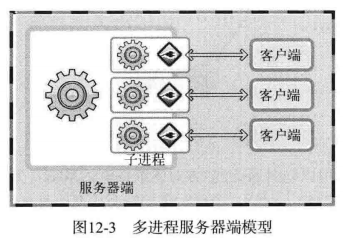
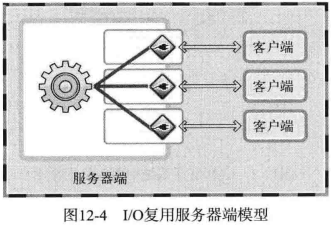
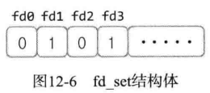
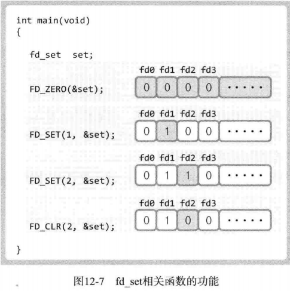
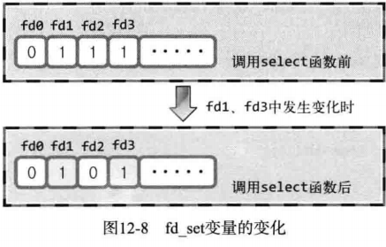

### 基于 I/O 复用的服务器端

之前为了构建并发服务器，学了多进程服务器端，用fock多创建些进程。有缺点

#### 多进程服务端的缺点和解决方法

创建进程要付出很大的代价。这需要大量的运算和内存空间，由于每个进程都具有独立的内存空间，所以相互间的数据交换也要采用相对复杂的方法（IPC 属于相对复杂的通信方法）

I/O 复用技术可以解决这个问题。

####  理解复用

> 在 1 个通信频道中传递多个数据（信号）的技术

「复用」的含义：

> 为了提高物理设备的效率，只用最少的物理要素传递最多数据时使用的技术

上述两种方法的内容完全一致。

太nm抽象了，就相当于一个服务端多用几次的感觉，尽量的去减少浪费，大概这么理解吧。

#### 复用技术在服务器端的应用

服务器端引入复用技术可以减少所需进程数。下图是多进程服务端的模型：



下图是引入复用技术之后的模型：



从图上可以看出，引入复用技术之后，可以减少进程数。重要的是，无论连接多少客户端，提供服务的进程只有一个。

**这是就会有一个很奇怪的想法了：既然一个服务器端可以解决的事情，那为什么还要用多进程的方式？？？？**

### 理解 select 函数并实现服务端

select 函数是最具代表性的实现复用服务器的方法。在 Windows 平台下也有同名函数，所以具有很好的移植性。

####  select 函数的功能和调用顺序

使用 select 函数时可以将多个文件描述符集中到一起统一监视，项目如下：

- 是否存在套接字接收数据？
- 无需阻塞传输数据的套接字有哪些？
- 哪些套接字发生了异常？

> 术语：「事件」。当发生监视项对应情况时，称「发生了事件」。

可以说select函数是I/O复用的全部。

####  设置文件描述符

利用 select 函数可以同时监视多个文件描述符。当然，监视文件描述符可以视为监视套接字。此时首先需要将要监视的文件描述符集中在一起。集中时也要按照监视项（接收、传输、异常）进行区分，即按照上述 3 种监视项分成 3 类。

利用 fd_set 数组变量执行此操作，如图所示，该数组是存有0和1的位数组。



图中最左端的位表示文件描述符 0（所在位置）。如果该位设置为 1，则表示该文件描述符是监视对象。那么图中哪些文件描述符是监视对象呢？很明显，是描述符 1 和 3。在 fd_set 变量中注册或更改值的操作都由下列宏完成。

- `FD_ZERO(fd_set *fdset)`：将 fd_set 变量所指的位全部初始化成0
- `FD_SET(int fd,fd_set *fdset)`：在参数 fdset 指向的变量中注册文件描述符 fd 的信息
- `FD_SLR(int fd,fd_set *fdset)`：从参数 fdset 指向的变量中清除文件描述符 fd 的信息
- `FD_ISSET(int fd,fd_set *fdset)`：若参数 fdset 指向的变量中包含文件描述符 fd 的信息，则返回「真」

上述函数中，FD_ISSET 用于验证 select 函数的调用结果，通过下图解释这些函数的功能：



我个人认为，以上的函数都是为了FD_ISSET而准备的，而这个select的核心呢，就是FD_ISSET函数，因为这个函数可以分辨出来哪些文件发生了变化，从而对变化的文件做相应的操作。

#### 设置检查（监视）范围及超时

下面是 select 函数的定义：

```
#include <sys/select.h>
#include <sys/time.h>

int select(int maxfd, fd_set *readset, fd_set *writeset,
           fd_set *exceptset, const struct timeval *timeout);
/*
成功时返回大于 0 的值，失败时返回 -1
maxfd: 监视对象文件描述符数量
readset: 将所有关注「是否存在待读取数据」的文件描述符注册到 fd_set 型变量，并传递其地址值。
writeset: 将所有关注「是否可传输无阻塞数据」的文件描述符注册到 fd_set 型变量，并传递其地址值。
exceptset: 将所有关注「是否发生异常」的文件描述符注册到 fd_set 型变量，并传递其地址值。
timeout: 调用 select 函数后，为防止陷入无限阻塞的状态，传递超时(time-out)信息
返回值: 发生错误时返回 -1,超时时返回0,。因发生关注的时间返回时，返回大于0的值，该值是发生事件的文件描述符数。
*/
```

如上所述，select 函数用来验证 3 种监视的变化情况，根据监视项声明 3 个 fd_set 型变量，分别向其注册文件描述符信息，并把变量的地址值传递到上述函数的第二到第四个参数。

如上所述，select 函数用来验证 3 种监视的变化情况，根据监视项声明 3 个 fd_set 型变量，分别向其注册文件描述符信息，并把变量的地址值传递到上述函数的第二到第四个参数。但在此之前（调用 select 函数之前）需要决定下面两件事：

1. 文件描述符的监视（检查）范围是？
2. 如何设定 select 函数的超时时间？

第一，文件描述符的监视范围和 select 的第一个参数有关。实际上，select 函数要求通过第一个参数传递监视对象文件描述符的数量。因此，需要得到注册在 fd_set 变量中的文件描述符数。但每次新建文件描述符时，其值就会增加 1 ，故只需将最大的文件描述符值加 1 再传递给 select 函数即可。加 1 是因为文件描述符的值是从 0 开始的。***这是文件描述符的特性，第一遍的时候没看懂这句，就是因为我不知道以下这点：每需要新分配一个文件描述符，这个描述符是会按照之前的逐个加1完成的，其实0-2的文件描述符是固定的0代表的是标准输入，可以理解为控制台上的信息，1代表的是标准输出，2代表的是标准错误，所以第一个自由分配的文件描述符是从3开始的。***

第二，select 函数的超时时间与 select 函数的最后一个参数有关，其中 timeval 结构体定义如下：

```
struct timeval
{
    long tv_sec;//秒数
    long tv_usec;//微秒数
};
```

本来 select 函数只有在监视文件描述符发生变化时才返回。如果未发生变化，就会进入阻塞状态。指定超时时间就是为了防止这种情况的发生。

####  调用 select 函数查看结果

select 返回正整数时，怎样获知哪些文件描述符发生了变化？向 select 函数的第二到第四个参数传递的 fd_set 变量中将产生如图所示的变化：



由图可知，select 函数调用完成后，向其传递的 fd_set 变量将发生变化。原来为 1 的所有位将变成 0，但是发生了变化的文件描述符除外。因此，可以认为值仍为 1 的位置上的文件描述符发生了变化。因为每次调用select后，没有发生变化的文件的位置都会被初始化为0；

####  select 函数调用示例

下面是一个 select 函数的例子：

- [select.c](https://github.com/riba2534/TCP-IP-NetworkNote/blob/master/ch12/select.c)

#### 实现 I/O 复用服务器端

下面通过 select 函数实现 I/O 复用服务器端。下面是基于 I/O 复用的回声服务器端。

下面通过 select 函数实现 I/O 复用服务器端。下面是基于 I/O 复用的回声服务器端。

- [echo_selectserv.c](https://github.com/riba2534/TCP-IP-NetworkNote/blob/master/ch12/echo_selectserv.c)