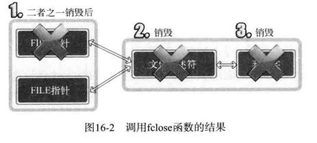

#### 2次 I/O 流分离

之前有两种分离方法：

- 第一种是第 10 章的「TCP I/O 过程」分离。**通过调用 fork 函数复制出一个文件描述符**，以区分输入和输出中使用的文件描述符。虽然文件描述符本身不会根据输入和输出进行区分，但我们分开了 2 个文件描述符的用途，因此，这也属于「流」的分离。
- 第二种分离是在第 15 章。通过 2 次 fdopen 函数的调用，创建读模式 FILE 指针（FILE 结构体指针）和写模式 FILE 指针。换言之，我们分离了输入工具和输出工具，因此也可视为「流」的分离。下面是分离的理由。

#### 好处

首先是第 10 章「流」的分离目的：

- 通过分开输入过程（代码）和输出过程降低实现难度
- 与输入无关的输出操作可以提高速度

下面是第 15 章「流」分离的目的：

- 为了将 FILE 指针按读模式和写模式加以区分
- 可以通过区分读写模式降低实现难度
- 通过区分 I/O 缓冲提高缓冲性能

### 文件描述符的的复制和半关闭

#### 终止「流」时无法半关闭原因

给出很明显的一张图，一眼就明白



很明显

套接字和文件描述符具有如下关系：

> 销毁所有文件描述符候才能销毁套接字

#### 复制文件描述符

与调用 fork 函数不同，调用 fork 函数将复制整个进程，此处讨论的是同一进程内完成对完成描述符的复制。

复制完成后，两个文件描述符都可以访问文件，但是编号不同。

#### dup 和 dup2

下面给出两个函数原型：

```
#include <unistd.h>
int dup(int fildes);
int dup2(int fildes, int fildes2);
/*
成功时返回复制的文件描述符，失败时返回 -1
fildes : 需要复制的文件描述符
fildes2 : 明确指定的文件描述符的整数值。
*/
```

dup2 函数明确指定复制的文件描述符的整数值。向其传递大于 0 且小于进程能生成的最大文件描述符值时，该值将成为复制出的文件描述符值。

####  复制文件描述符后「流」的分离

其实还是需要shutdown的帮助.


